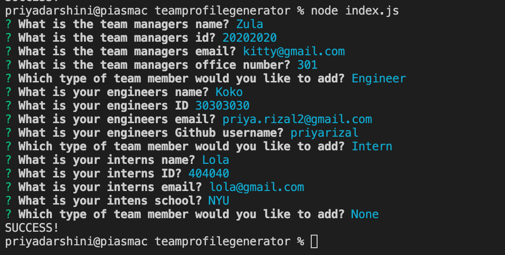

# teamprofilegenerator
# Node.js Professional README Generator
This project is a Node.js command-line application that takes in information about employees on a software engineering team, then generates an HTML webpage that displays summaries for each person. I've used [Inquirer package](https://www.npmjs.com/package/inquirer) for user's input. 

To learn TDD, I've written a unit test for every part of my code to ensure that it passes each test.

The command-line prompts accepts user input when prompted for team members to input their information. An HTML file is generated based on their input. User's can click on email, github, and school of the teammembers and it'll open in a new tab. 


information about their application repository. The prompt includes information about the title of users' project, & sections entitled Description, Table of Contents, Installation, Usage, License, Contributing, Tests, and Questions. When users' choose a license for their application from the list of options, then a badge for that license is added near the top of the README. Users' github username, email address, and LinkedIn are all added for any futhur questions by readers. User's will also be prompted to enter team managerr's name, employee ID, email address, and office number which then presents them with an option to add an engineer or an intern to their team. IF user's select engineer, then they will be prompted to enter engineer’s name, ID, email, and GitHub username. If they pick intern, then they will be prompted to enter intern’s name, ID, email, and school. When user's decide to finish building the team, then the HTML gets generated.

email needs to be clickable and open to a new tab
github profile needs to be clickable and open to a new tab
same with school


## Installation
 To utilize the TeamMember generator within your command line, users' would need to install node.js and npm inquirer and jest package. 


## Code Snippets
 - TDD 

 ```
 const Employee = require("../lib/Employee");

describe("employee", () => {
    describe("Initilization", () => {
        it("should be created with name, id, and email ", () => {

            const employee = new Employee("Zula", 2, "Zulaisakitty@kitty.com")

            expect(typeof(employee)).toBe("object");
            // expect(employee.email).tobe("value")
        })

    })
})

 ```

 ```
 const Intern = require("../lib/Intern");

describe("Intern", () => {
    describe(" ", () => {
    it('should return intern for getrole', () => {
        const expectedValue = "Intern"
        const intern = new Intern ("Priya", 44,"piya22@gmail.com", "Mills College")
    expect(intern.getRole()).toBe(expectedValue)
    });
})
})

describe("Intern", () => {
    describe(" ", () => {
    it('should get school', () => {
        const expectedValue = "Mills College"
        const intern = new Intern ("Priya", 44, "piya22@gmail.com", "Mills College")
    expect(intern.getSchool()).toBe(expectedValue)
    });
})
})
```

## Technologies Used
- JavaScript
- Node.js
- NPM
- Jest


## Tests 
- Run the following command to run test

 ```terminal
node index.js
npm run test
```
 

## Gif walkthrough


## License
MIT

## Contributors
- Alejandra Izquierdo


## Questions
If you have any questions about the project, please feel free to reach me at priya.rizal2@gmail.com